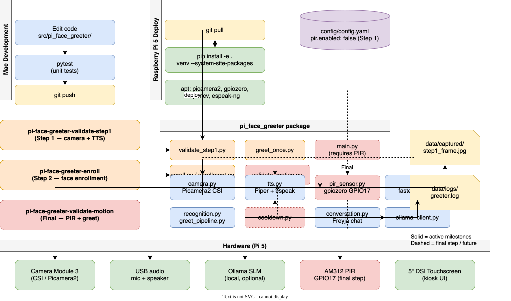

 # Pi Face Greeter

A Raspberry Pi 5 face recognition greeter for a door or entryway. The **kiosk app** on the DSI touchscreen is the primary experience: live camera preview, face recognition, natural speech, and a settings screen to enroll people. An optional PIR motion loop (`pi-face-greeter`) runs headless when you do not use the display.

---

## Table of Contents

1. [Project Overview](#project-overview)
2. [Architecture](#architecture)
3. [Hardware List](#hardware-list)
4. [Physical Assembly Order](#physical-assembly-order)
5. [GPIO Wiring](#gpio-wiring)
6. [Raspberry Pi OS Setup](#raspberry-pi-os-setup)
7. [Enable Camera](#enable-camera)
8. [USB Audio Setup](#usb-audio-setup)
9. [Develop on Mac](#develop-on-mac)
10. [Deploy to Raspberry Pi](#deploy-to-raspberry-pi)
11. [Step 1 Validation (Camera + TTS)](#step-1-validation-camera--tts)
12. [Step 2 Face Enrollment](#step-2-face-enrollment)
13. [Final Step: Motion Sensor (PIR)](#final-step-motion-sensor-pir)
14. [Hardware Test Order](#hardware-test-order)
15. [Run the Main App](#run-the-main-app)
16. [Project Structure](#project-structure)
17. [Troubleshooting](#troubleshooting)
18. [Next Milestones](#next-milestones)

---

## Project Overview

Pi Face Greeter sits by your door and:

1. Detects a face at the camera (kiosk) or motion from the PIR (optional)
2. Captures frames and identifies known faces with `face_recognition` (dlib)
3. Builds a greeting (canned phrases or optional local Ollama)
4. Speaks through Piper TTS (USB speaker)
5. Shows status on the Hosyond 5" DSI touchscreen

**Milestone order:**

| Step | What | Command |
|------|------|---------|
| 1 | **Kiosk app** (animated face, camera preview, settings, recognition) | `pi-face-greeter-app` |
| 2 | Face enrollment (CLI or from settings UI) | `pi-face-greeter-enroll` |
| — | Hardware validators (camera, TTS, enroll CLI) | `pi-face-greeter-validate-step1`, etc. |
| Last | PIR motion loop (optional) | `pi-face-greeter-validate-motion` then `pi-face-greeter` |

PIR stays disabled (`pir.enabled: false`) until the **final** optional step.

**Kiosk app:** Swipeable touchscreen UI with an animated face, live camera preview (yellow box on detected faces), spoken "Hi \<name\>" / "Hi friend" on presence, and a settings screen to enroll and manage faces from the live camera.

---

## Architecture



Source: [architecture/architecture.drawio](architecture/architecture.drawio). Solid = active milestones. Dashed = final PIR step / future.

Regenerate after diagram edits:

```bash
drawio -x -f svg -o architecture/architecture.svg architecture/architecture.drawio
drawio -x -f png -o architecture/architecture.png architecture/architecture.drawio
```

| Module | Path | Role |
|--------|------|------|
| Kiosk app | `src/pi_face_greeter/app/` | Kivy UI: animated face, camera preview, settings |
| Main loop | `src/pi_face_greeter/main.py` | Motion → capture → TTS → cooldown (PIR, optional) |
| Step 1 validator | `src/pi_face_greeter/validate_step1.py` | Camera + TTS |
| Step 2 enrollment | `src/pi_face_greeter/enroll.py` | Capture known-face photos + embeddings (CLI) |
| Recognition | `src/pi_face_greeter/recognition.py`, `recognizer.py` | Load encodings, identify faces |
| Greeting pipeline | `src/pi_face_greeter/greet_pipeline.py` | Shared greet text + TTS for kiosk and PIR |
| Motion validator | `src/pi_face_greeter/validate_motion.py` | PIR + one greet (final step) |
| PIR | `src/pi_face_greeter/pir_sensor.py` | gpiozero wrapper for AM312 |
| Camera | `src/pi_face_greeter/camera.py` | Picamera2 (CSI) backend |
| TTS | `src/pi_face_greeter/tts.py` | Piper neural TTS (espeak-ng fallback) |
| Conversation | `src/pi_face_greeter/conversation.py` | Freyja voice chat + optional one-shot Ollama greetings |
| Mic / VAD | `src/pi_face_greeter/mic.py`, `vad.py` | Shared USB mic stream + Silero speech detection |
| Wake word | `src/pi_face_greeter/wake_word.py` | openWakeWord listener ("Hey Freyja") |
| Speech-to-text | `src/pi_face_greeter/stt.py` | USB mic capture + faster-whisper |
| Ollama client | `src/pi_face_greeter/ollama_client.py` | HTTP client for local Ollama |
| Config | `config/config.yaml` | Runtime settings |

**Camera path for this build:** You have a **Raspberry Pi Camera Module 3** (CSI). Use **Picamera2** (`camera.backend: picamera2` in config). JPEG saving uses Pillow (installed via pip).

**USB webcam alternative:** Set `camera.backend: opencv` and `camera.device_index: 0` — requires `python3-opencv` from apt.

See [docs/wiring.md](docs/wiring.md) for physical connections and [docs/roadmap.md](docs/roadmap.md) for future work.

---

## Hardware List

| Component | Notes |
|-----------|-------|
| Raspberry Pi 5 | 64-bit Raspberry Pi OS Trixie (Bookworm still supported) |
| Official 27W USB-C power supply | Required for stable camera + CPU load |
| Active cooler | Recommended for sustained use |
| Raspberry Pi Camera Module 3 | CSI ribbon cable |
| AM312 / HC-SR312 mini PIR | 3.3V power only |
| USB sound card + 8Ω 5W speaker | Driver-free, plug and play |
| Hosyond 5" MIPI DSI touchscreen | 800×480, capacitive — future UI |
| Female-to-female jumper wires | For PIR wiring |

---

## Physical Assembly Order

Follow this order on the bench before installing software.

### Step 1: Pi 5 base system

1. Attach the active cooler to the Pi 5.
2. Insert a microSD card flashed with **Raspberry Pi OS (64-bit) Trixie** (or Bookworm).
3. Connect HDMI (or DSI display later), keyboard, and the **27W USB-C power supply**.
4. Boot and complete initial setup (user, Wi‑Fi, updates).
5. Verify architecture:

```bash
uname -m
# Expected: aarch64
```

### Step 2: Camera Module 3

1. **Power off** the Pi.
2. Connect the CSI ribbon to the camera connector (see [docs/wiring.md](docs/wiring.md)).
3. Power on and enable the camera (see [Enable Camera](#enable-camera)).

### Step 3: DSI touchscreen (optional now)

1. **Power off** the Pi.
2. Connect the Hosyond 5" DSI ribbon per the display manual.
3. Power on — you should see the desktop at 800×480.
4. Run the kiosk app: `pi-face-greeter-app` (see [Run the Kiosk App](#run-the-kiosk-app)).

### Step 4: PIR sensor wiring

Wire the PIR **after** camera and audio are tested — see [GPIO Wiring](#gpio-wiring).

### Step 5: USB sound card + speaker

1. Connect the speaker to the sound card header.
2. Plug the USB sound card into the Pi.
3. Complete [USB Audio Setup](#usb-audio-setup).

### Step 6: Final checklist

- [ ] Pi boots reliably with PSU + cooler
- [ ] Camera detected (`rpicam-hello --list-cameras`)
- [ ] USB audio works (`speaker-test`)
- [ ] PIR wired to 3.3V, GND, GPIO17
- [ ] Project cloned and dependencies installed

---

## GPIO Wiring

| PIR pin | Pi physical pin | Pi function |
|---------|-----------------|-------------|
| VCC (+) | Pin 1           | 3.3V        |
| GND (-) | Pin 6           | GND         |
| OUT (S) | Pin 11          | GPIO17      |

**Do not power the PIR from 5V.** The AM312 / HC-SR312 expects 3.3V.

Full diagrams: [docs/wiring.md](docs/wiring.md)

---

## Raspberry Pi OS Setup

1. Flash **Raspberry Pi OS (64-bit) Trixie** using [Raspberry Pi Imager](https://www.raspberrypi.com/software/). Bookworm still works; recreate the project venv after upgrading the OS (do not copy a Bookworm `.venv` onto Trixie).
2. Enable SSH and set hostname/user in Imager if headless.
3. Boot the Pi and update:

```bash
sudo apt update
sudo apt full-upgrade -y
sudo reboot
```

4. Clone this project:

```bash
cd ~
git clone <your-repo-url> pi_face_greeter
cd pi_face_greeter
```

---

## Enable Camera

1. Enable the camera interface:

```bash
sudo raspi-config
# Interface Options → Camera → Enable → Finish → Reboot
```

2. Verify Camera Module 3:

```bash
rpicam-hello --list-cameras
rpicam-hello -t 5000
```

You should see a live preview for 5 seconds. Pi 5 exposes `cam0` and `cam1`; either port works.

**Do not use** legacy `raspicam` or `picamera` — they are unsupported on Bookworm.

---

## USB Audio Setup

1. List playback devices:

```bash
aplay -l
```

Example output on **Pi 5 with HDMI enabled** (card numbers vary by machine):

```
card 0: vc4hdmi0 [vc4-hdmi-0], device 0: ...
card 1: vc4hdmi1 [vc4-hdmi-1], device 0: ...
card 2: Device [USB PnP Audio Device], device 0: USB Audio [USB Audio]
```

The greeter **automatically picks USB ALSA cards** when `tts.alsa_device` and `stt.alsa_device` are `null` (default). Playback uses the first USB card in `aplay -l`. Capture uses the first USB card in `arecord -l`, but if you have **separate USB speaker and mic dongles**, it prefers a capture card **different from** the playback card so the mic is not the speaker adapter.

2. Test the USB speaker manually (use the card number from your `aplay -l` line that contains `USB`):

```bash
speaker-test -D plughw:2,0 -c 2 -t wav
```

Press Ctrl+C after confirming audio.

3. Optional override in `config/config.yaml` (only if auto-detection is wrong):

```yaml
tts:
  alsa_device: "plughw:2,0"
```

Leave as `null` for normal USB speaker use.

---

## Develop on Mac

```bash
git clone <your-repo-url> pi_face_greeter
cd pi_face_greeter
python3 -m venv .venv
source .venv/bin/activate
pip install -e ".[dev]"
pytest
```

Hardware tests (camera, TTS, PIR) run on the Pi only. Push after `pytest` passes.

---

## Deploy to Raspberry Pi

Quick setup from the project root on the Pi:

```bash
cd ~/pi_face_greeter
git pull
./scripts/setup_system.sh
# log out and back in after system setup (group membership + Ollama)
./scripts/setup_venv.sh
./scripts/start.sh
```

`setup_system.sh` installs apt packages and Ollama. `setup_venv.sh` installs the optional `[recognition]`, `[voice]`, and `[stt]` extras, downloads Piper and faster-whisper models, and pulls the Ollama SLM. The dlib compile can take 30+ minutes on a Pi — run it once and leave the terminal open.

`start.sh` checks system tools and the venv, starts Ollama if needed, pulls the SLM when missing, and launches the kiosk (`pi-face-greeter-app`). Use it as the day-to-day command on the Pi.

Or update an existing install:

```bash
cd ~/pi_face_greeter
git pull
source .venv/bin/activate
pip install -e ".[recognition]"
pip install -e ".[voice]"
pip install -e ".[stt]"
./scripts/setup_venv.sh
```

Install system packages manually (once on the Pi):

```bash
sudo apt update
sudo apt install -y \
  python3-picamera2 python3-libcamera rpicam-apps \
  python3-gpiozero python3-lgpio \
  python3-opencv \
  libsdl2-dev libsdl2-image-dev libsdl2-mixer-dev libsdl2-ttf-dev \
  pkg-config libmtdev-dev xinput xfonts-base xfonts-scalable \
  espeak-ng alsa-utils v4l-utils \
  cmake build-essential libopenblas-dev liblapack-dev libjpeg-dev libsndfile1

sudo usermod -aG video,gpio $USER
```

Or run `./scripts/setup_system.sh` to install the packages and Ollama automatically.

Create the venv on the Pi with system site packages so apt libraries are visible:

```bash
python3 -m venv --system-site-packages .venv
source .venv/bin/activate
pip install -e ".[recognition]"
pip install -e ".[voice]"
pip install -e ".[stt]"
./scripts/setup_venv.sh
```

Or run `./scripts/setup_venv.sh` to create the venv and install the package.

Log out and back in for group membership. Do **not** pip install `picamera2`, `opencv-python`, or `RPi.GPIO`.

---

## Run the Kiosk App

Primary experience on the Hosyond 5" DSI touchscreen:

```bash
./scripts/start.sh
```

Or, with the venv already active: `pi-face-greeter-app`.

- **Face screen (default):** Split layout — animated face on the left (two-thirds of the screen); on the right, a square live camera preview (center-cropped, yellow boxes on faces), a status line (**Listening…**, **Thinking…**), and a scrollable conversation log (**Name:** / **Freyja:**). Greets recognized people with **Hi, \<name\>. How are you?** (or a custom `greeting:` from `people.yaml`). With voice conversation enabled, **Freyja** listens and replies through the local Ollama model. During greet cooldown, say **Hey Freyja** to start talking again.
- **Settings screen:** Swipe left. Add, list, edit, and delete faces. **Add Face** captures photos from the live camera (same `CameraSource` as the face screen), computes face embeddings, and reloads recognition without restarting the app.

On Mac for UI development, set `camera.backend: opencv` in `config/config.yaml` and install dev deps: `pip install -e ".[dev]"`.

UI settings in `config/config.yaml` under `ui:`:

- `presence_frames_required` — consecutive face-detection frames before starting recognition
- `recognition_frames_required` — same identity must confirm over N frames before greeting (reduces misfires)
- `greet_cooldown_seconds` — default per-person cooldown between greetings (kiosk and optional PIR loop)
- `settings_pin` — optional PIN required to add, rename, or delete faces on the settings screen (empty = unlocked; set on the Pi in `config/config.yaml`)

Optional per-person overrides in `config/people.yaml`:

```yaml
people:
  - name: Todd
    face_dir: data/known_faces/todd
    greeting: "Welcome home, Todd!"
    cooldown_seconds: 120
```

### Natural voice (Piper)

The kiosk uses **Piper** neural TTS by default (`tts.engine: piper`) with **`en_US-lessac-high`** (natural US female). Set `tts.fallback_to_espeak: true` only if you want espeak-ng when Piper fails; the default is `false` so a missing model surfaces as an error instead of a robotic voice.

One-time setup on the Pi (included in `./scripts/setup_venv.sh`):

```bash
pip install -e ".[voice]"
./scripts/setup_venv.sh   # downloads ~63MB Piper model to data/voices/
```

The voice model is downloaded **once per Pi**, not per face or greeting. To swap voices, change `tts.piper.model` and download a different `.onnx` from [rhasspy/piper-voices](https://huggingface.co/rhasspy/piper-voices).

Use `tts.engine: espeak` to force the old robotic voice. Toggle `tts.ask_how_are_you: false` to skip the follow-up question.

### Freyja voice conversation (mic + Ollama)

**Freyja** is the built-in executive assistant. The default config enables conversation: face recognized → **Hi, {name}. How are you?** → listen → local **Ollama** reply (streamed, spoken in batched chunks) → listen again. The kiosk shows a scrollable transcript in the right panel (`Todd: …`, `Freyja: …`) under the camera preview. If nothing is heard, the status shows **Didn't catch that** briefly. Cooldown only blocks repeating the face greeting; say **Hey Freyja** anytime to talk. `ollama.base_url` must be `http://localhost` or `http://127.0.0.1`.

One-time setup (included in `./scripts/setup_system.sh` and `./scripts/setup_venv.sh`):

```bash
./scripts/setup_system.sh   # installs Ollama (log out/in after)
./scripts/setup_venv.sh     # Piper + faster-whisper + Silero VAD + llama3.2:1b
```

Key settings in `config/config.yaml`:

```yaml
ollama:
  enabled: true
conversation:
  enabled: true
  listen_chime: true
assistant:
  name: Freyja
wake_word:
  enabled: true
  model: data/models/hey_freyja.onnx   # or hey_jarvis to test before training
stt:
  alsa_device: null   # override only if auto-detect picks the wrong dongle
  vad_threshold: 0.5
tts:
  fallback_to_espeak: false
  piper:
    model: data/voices/en_US-lessac-high.onnx
```

If the mic seems dead after **Listening…**, check `data/logs/greeter.log` for lines like `No speech within start timeout: frames=… peak_vad=… peak_rms=…` (low `peak_rms` → mic or ALSA device; low `peak_vad` with healthy RMS → try lowering `vad_threshold`).

**Custom wake word:** Train `hey_freyja.onnx` with the [openWakeWord training notebook](https://github.com/dscripka/openWakeWord). Use phonetic TTS text **hey fraya** when generating training clips. Until the file exists, face greetings still work; set `wake_word.model: hey_jarvis` to try wake word immediately.

If `conversation.enabled` is false but `ollama.enabled` is true, the greeter falls back to one-shot Ollama greetings without the mic loop.

Smoke tests:

```bash
pi-face-greeter-test-ollama
pi-face-greeter-test-stt
pi-face-greeter-test-wake
```

### Debugging / sharing logs

When face detection is not working, enable diagnostics to capture detailed logs and annotated camera snapshots:

```bash
PI_FACE_GREETER_DEBUG=1 pi-face-greeter-app
```

Or set `diagnostics.debug: true` in `config/config.yaml`.

On startup the app prints the absolute paths for:

- **Log file:** `data/logs/greeter.log` (frame stats, cascade path, detection params, face counts)
- **Debug snapshots:** `data/debug/` (JPEG every 2s with yellow boxes drawn on detected faces)

Share `data/logs/greeter.log` and the latest images from `data/debug/` to diagnose detection issues. Adjust snapshot frequency via `diagnostics.snapshot_interval_seconds`.

### Log rotation

Logs rotate automatically via `logging.max_bytes` and `logging.backup_count` in `config/config.yaml`. Total on-disk size is roughly `max_bytes × (backup_count + 1)` (default ~4 MB). Lower `max_bytes` if debug mode fills logs quickly — debug logs per-frame detection stats.

---

## Step 1 Validation (Camera + TTS)

After camera and USB audio are wired, set `tts.alsa_device` if needed (see [USB Audio Setup](#usb-audio-setup)), then:

```bash
pi-face-greeter-validate-step1
```

**Output:** one success line, or a failure summary with log path and tail. Full detail is in `data/logs/greeter.log`.

Success example: `Step 1 passed. Frame: data/captured/step1_frame.jpg`

Manual single greet (no PIR, no loop):

```bash
pi-face-greeter-greet-once
```

---

## Step 2 Face Enrollment

After Step 1 passes, enroll known people by capturing reference photos:

```bash
pi-face-greeter-enroll Todd
```

Options: `--count 5` to override `enrollment.capture_count` in config.

**Output:** one success line or failure summary with log tail (same quiet pattern as Step 1).

Success example: `Step 2 passed. Enrolled Todd: 5 photos in data/known_faces/todd`

Photos are saved as `001.jpg`, `002.jpg`, … under `data/known_faces/<slug>/`, with stacked 128-d embeddings in `encodings.npy`. The person is registered in `config/people.yaml`.

Optional per-person greeting in `config/people.yaml`:

```yaml
people:
  - name: Todd
    face_dir: data/known_faces/todd
    greeting: "Welcome home, Todd!"
```

Recognition tolerance (lower = stricter matching) in `config/config.yaml`:

```yaml
recognition:
  tolerance: 0.6
```

If `python3-opencv` is installed on the Pi, each frame is checked for exactly one face during enrollment.

---

## Final Step: Motion Sensor (PIR)

**Do this last**, after enrollment and recognition are working.

Wire the PIR, then set in `config/config.yaml`:

```yaml
pir:
  enabled: true
  gpio_pin: 17
```

Validate motion triggers a full greet cycle:

```bash
pi-face-greeter-validate-motion
```

Then run the production loop:

```bash
pi-face-greeter
```

---

## Python Setup

Install from [pyproject.toml](pyproject.toml): `pip install -e ".[dev]"` on Mac or `pip install -e ".[recognition,voice,stt]"` on the Pi.

**Pi venv must use `--system-site-packages`** so Picamera2, gpiozero, and OpenCV from apt are available.

---

## Install Dependencies

See [Deploy to Raspberry Pi](#deploy-to-raspberry-pi) for the apt install block.

---

## Hardware Test Order

From project root with venv activated on the **Pi**:

```bash
cd ~/pi_face_greeter
source .venv/bin/activate
```

### 1. Kiosk app (primary)

```bash
pi-face-greeter-app
```

### 2. Step 1 validation (camera + TTS)

```bash
pi-face-greeter-validate-step1
```

Or run components individually:

```bash
pi-face-greeter-test-camera
pi-face-greeter-test-tts
```

### 3. Step 2 enrollment

```bash
pi-face-greeter-enroll Todd
```

### 4. Final step — motion (when PIR is wired)

Set `pir.enabled: true`, then:

```bash
pi-face-greeter-validate-motion
pi-face-greeter
```

```bash
pi-face-greeter-test-camera
pi-face-greeter-test-tts
pi-face-greeter-test-pir
```

---

## Run the Main App

**Primary (DSI kiosk):**

```bash
pi-face-greeter-app
```

**Optional PIR loop** (requires `pir.enabled: true`):

```bash
pi-face-greeter
```

Configuration: `config/config.yaml`. Logs: `data/logs/greeter.log`.

### systemd user service (kiosk — test on hardware first)

Template: [systemd/pi-face-greeter.service](systemd/pi-face-greeter.service). Edit `USER`, paths, and `ExecStart` (`pi-face-greeter-app`), then install as a **user** unit so Kivy can use the graphical session:

```bash
mkdir -p ~/.config/systemd/user
cp systemd/pi-face-greeter.service ~/.config/systemd/user/
systemctl --user daemon-reload
systemctl --user enable pi-face-greeter
systemctl --user start pi-face-greeter
```

---

## Project Structure

```
pi_face_greeter/
├── pyproject.toml
├── README.md
├── architecture/
│   ├── architecture.drawio
│   ├── architecture.svg
│   └── architecture.png
├── config/
│   ├── config.yaml
│   └── people.yaml
├── src/pi_face_greeter/
│   ├── app/                 # Kivy UI only (screens, camera source)
│   ├── recognition.py       # Recognition facade
│   ├── greet_pipeline.py    # Shared greeting + TTS
│   ├── main.py              # Optional PIR loop
│   ├── validate_step1.py
│   ├── greet_once.py
│   ├── cli.py
│   ├── camera.py
│   ├── tts.py
│   ├── pir_sensor.py
│   └── ...
├── scripts/                 # thin wrappers (backward compatible)
├── tests/
├── data/
├── docs/
└── systemd/
```

---

## Troubleshooting

### PIR never triggers

- Confirm **3.3V** on pin 1 (not 5V).
- Confirm OUT → GPIO17 (physical pin 11).
- Wait 15–30 s after power-on for sensor stabilization.
- Keep sensor away from heat sources.

### PIR triggers constantly

- Repoint away from vents, windows, or moving curtains.
- Increase distance from the Pi board (PIR can be sensitive to warm electronics).

### Camera not detected

```bash
rpicam-hello --list-cameras
```

- Reseat CSI ribbon with Pi **powered off**; contacts face the board.
- Enable camera in `raspi-config`.
- Try the other CSI port (`cam0` vs `cam1`).

### No audio from USB speaker

```bash
aplay -l
speaker-test -D plughw:N,0 -c 2 -t wav   # N = card number of the USB line
```

- With `tts.alsa_device` / `stt.alsa_device` null, the app picks USB cards automatically (mic avoids the playback card when two USB capture devices exist).
- Set `tts.alsa_device` or `stt.alsa_device` only to override (e.g. `plughw:2,0`).
- For mic issues: `arecord -l` and check logs for `Mic stream ALSA: playback=... capture=...`.
- Confirm speaker wired to sound card header with correct polarity.
- Check volume: `alsamixer` (select USB card with F6).

### gpiozero / GPIO errors on Pi 5

- Use **gpiozero** with **lgpio** (installed via apt above).
- Do **not** use `RPi.GPIO` — it does not work on Pi 5.
- Ensure user is in the `gpio` group: `groups` should list `gpio`.

### Picamera2 import errors in venv

- Recreate venv with system site packages:

```bash
python3 -m venv --system-site-packages .venv
```

- Confirm apt package: `dpkg -l python3-picamera2`

### Permission denied on camera

```bash
sudo usermod -aG video $USER
# log out and back in
```

---

## Next Milestones

See [docs/roadmap.md](docs/roadmap.md) for the full roadmap:

1. systemd auto-start for kiosk (user service)
2. Privacy mode / mute button
3. PIR motion loop validation on hardware

---

## TODO List

- [x] Add touchscreen kiosk UI (Hosyond 5" DSI)
- [x] Animated face with blinking eyes and talking mouth
- [x] Live camera preview with face detection boxes
- [x] Settings screen for face CRUD + live enrollment
- [x] Face recognition via `face_recognition` (dlib)
- [x] Generate face embeddings (`encodings.npy`)
- [x] Confidence threshold (`recognition.tolerance`)
- [x] Require multiple matching frames before greeting
- [x] Per-person greeting messages (`greeting:` in people.yaml)
- [x] Per-person cooldown (`cooldown_seconds:` in people.yaml)
- [x] Enrollment photo capture from settings UI
- [x] Piper TTS for natural voice (espeak fallback)
- [x] Ollama SLM for light local conversation (opt-in; see [docs/roadmap.md](docs/roadmap.md))
- [ ] Add systemd user service for kiosk boot startup
- [ ] Add privacy mode / mute button
- [ ] Add optional logging to SQLite
- [ ] Add optional AWS sync later

---

## License

MIT (or your chosen license)
